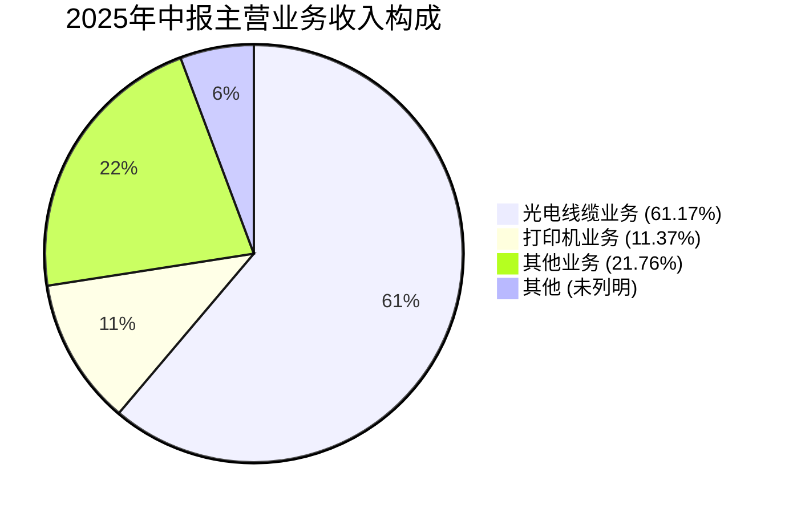
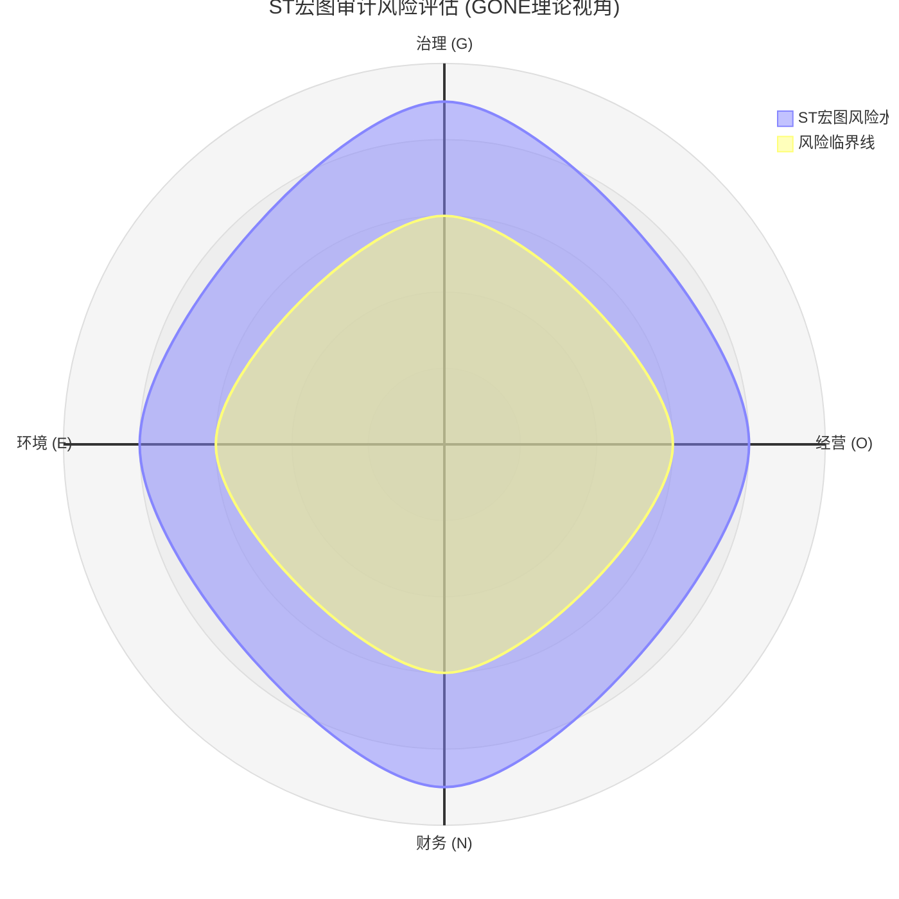

# ST宏图（600122）审计风险研究数据 (基于GONE理论)

**数据整理日期：** 2025年12月3日
**股票状态：** 被实施退市风险警示（*ST）
**理论框架：** GONE理论 (治理Governance, 经营Operation, 财务Number, 环境Environment)

## 1. 治理结构 (Governance) 风险

- **证监会立案调查**：因涉嫌信息披露违法违规，公司及控股股东已被中国证监会立案调查[citation:3]。
- **风险提示**：治理层监督失效，信息披露真实性存疑，存在管理层凌驾于内部控制之上的风险，审计时应高度关注**舞弊风险**。

## 2. 经营状况 (Operation) 风险

### 主营业务表现 (基于2025年中期报告)

*数据来源：搜狐股票[citation:4]*

### GONE 理论四维度审计风险评估（ST宏图）

- **地区高度集中**：92.23%的营业收入来自江苏地区[citation:4]。
- **重整不确定性**：公司已启动预重整程序，并与中国长城资产管理股份有限公司江苏省分公司签署了《重整投资意向协议》，但该事项尚存在重大不确定性[citation:3][citation:9]。
- **风险提示**：**持续经营能力存在重大疑虑**。核心业务大幅萎缩，且经营严重依赖单一区域。重整成功与否直接决定公司能否存续，是审计中必须评估的关键事项。

## 3. 财务表现 (Number) 风险

- **公开债务违约**：2025年6月30日，公司公告“17宏图高科MTN001”中期票据因**流动性匮乏**，无力偿还剩余本息合计**5,409万元**，已构成实质性违约[citation:9]。
- **面临重大诉讼索赔**：2025年8月1日，公司因证券虚假陈述责任纠纷，单日新增**8起**被起诉案件[citation:6]。这可能导致公司承担大额赔偿责任，进一步侵蚀净资产。
- **风险提示**：**偿债能力已严重恶化**。债务违约是财务危机的明确信号。由虚假陈述引发的诉讼，不仅带来财务损失，也印证了公司在“治理(G)”层面的信息披露存在问题，审计时需重点关注预计负债的完整性。

## 4. 外部环境 (Environment) 风险

- **退市风险警示**：公司股票已被实施“*ST”，若后续情况恶化，将面临终止上市的风险。
- **投资者诉讼压力**：众多中小投资者发起诉讼索赔，形成持续的外部追责压力[citation:6]。
- **风险提示**：退市压力是迫使管理层采取短期行为（如财务粉饰）的强烈外部动机。审计时需要警惕在**持续经营、资产估值、收入确认**等方面的激进会计处理。

## 总结与审计启示

从GONE理论视角看，ST宏图在四个维度均呈现出极高的风险信号：
1.  **治理失效** 与 **环境压力**（退市）共同构成了强烈的**舞弊动机**。
2.  **经营困境** 与 **财务危机**（违约、诉讼）互为因果，使得**持续经营假设**的评估成为审计基石。
3.  审计程序应重点关注：**管理层诚信、关联方交易、收入真实性、债务与诉讼的完整性披露，以及基于持续经营假设的财务报表编制基础是否适当**。

---
**注：** 本文数据来源于上市公司公告、财经媒体公开报道及权威财经数据平台。数据截至2025年11月初。
